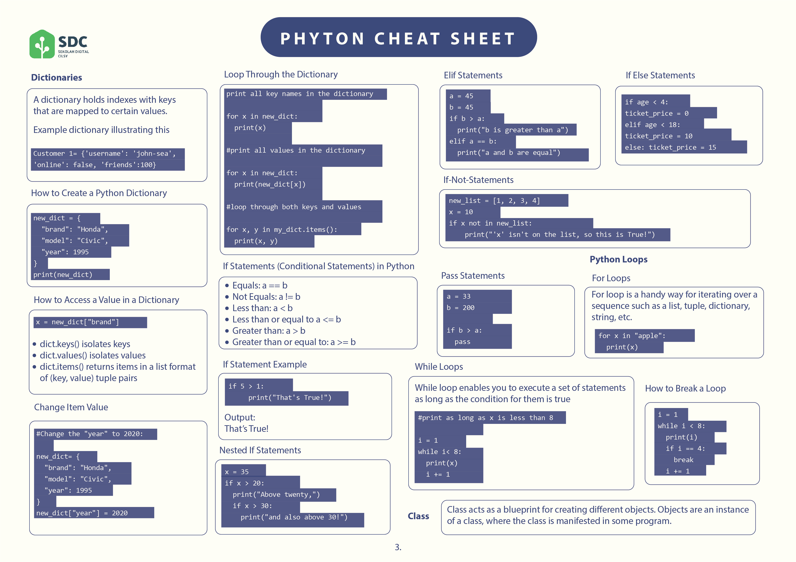

# Data Types in Python

Dalam pemrograman, tipe data merupakan konsep penting. Variabel dapat menyimpan berbagai jenis data, dan jenis yang berbeda dapat melakukan operasi yang berbeda sesuai kebutuhan.

Python memiliki beberapa tipe data, diantaranya :

- Number Types : int, float, complex

- String Type : str

- Sequence Types : list, tuple, range

- Set Types : set, frozenset

- Mapping Type : dict

- Boolean Type : bool

- Binary Types : bytes, bytearray, memoryview

Untuk mempermudah proses belajar, kalian bisa menggunakan cheatsheet yang telah tim Cilsy buat berikut.

