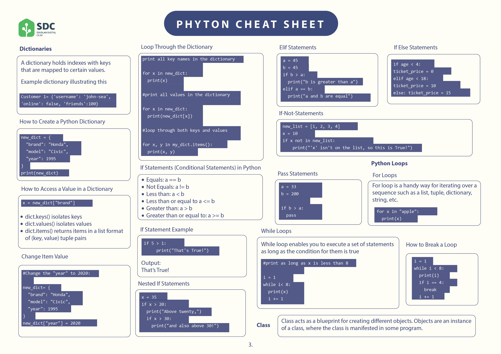

# Python Decision Making

Decision making adalah ekspektasi dari kondisi yang terjadi selama pelaksanaan program dan tindakan spesifik yang akan diambil berdasarkan kondisi tersebut.

Struktur decision mengevaluasi banyak ekspresi, yang menghasilkan TRUE atau FALSE sebagai hasilnya. Jika hasilnya TRUE atau FALSE, Anda perlu menentukan operasi yang akan dilakukan dan pernyataan yang akan dilakukan.

Bagaimana python menentukan hasil TRUE atau FALSE ? Jawabannya adalah menggunakan operator comparison. Dengan menggunakan operator ini, Python membandingkan expression dengan condition.

Strukturnya seperti ini

Coba lihat flowchart program berikut

  

Terdapat decision making dimana input diperiksa terlebih dahulu apakah valid atau tidak. Nah jika input valid, maka program akan melanjutkan ke langkah process. Jika tidak valid, maka program akan berhenti tanpa melakukan process atau output.

Untuk mempermudah kalian memahami apa saja yang perlu dipelajari, lihatlah mind-map berikut.

Untuk melihat beberapa contoh penggunaan decision making statement, kalian bisa merujuk ke cheatsheet yang kami berikan sebelumnya

Other references:

[Python Conditions](https://www.w3schools.com/python/python_conditions.asp)
